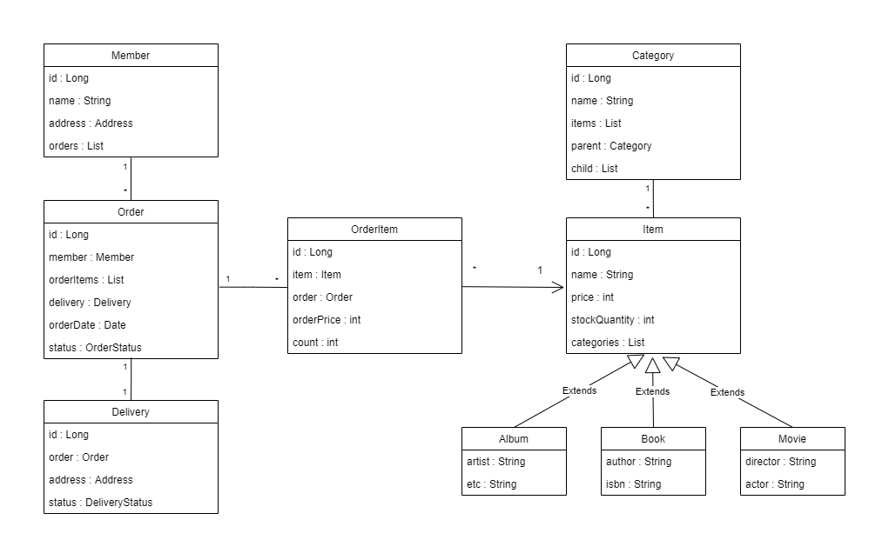

# Spring/JPA를 활용한 상품 주문 서비스

## 프로젝트 목표

Spring 프레임워크와 JPA의 개념을 숙지한 후, 이를 활용해 보며 여러 방면에 대한 역량을 키우는 것을 목표로 한다. 또한, 테스트 코드 작성을 습관화하여 구현한 기능이 잘 동작하는지 검증을 철저히 하는 것을 목표로 한다.

각 도메인들을 객체 지향에 걸맞게 설계해, 유지보수 및 확장에 용이하도록 한다.

### 사용된 언어 및 프레임워크
#
- JAVA
- Spring / Spring Boot
- JPA
- Thymeleaf (웹 계층 템플릿 엔진)

 ### 구현 목표 기능 (필수기능)
  #

- 상품 주문 / 상품 주문 취소
- 주문 조회 기능
- 주문 이력 검색 기능 (취소 여부 확인)
- 주문 및 주문 취소시 상품 재고량 변화
- 간단한 화면 구현 (Frontend)

### 구현 목표 기능 (확장기능)
#
- 로그인 기능
- 카테고리 별 상품 검색 기능
- 다양한 상품 종류 추가
- 배송 정보 조회
- 관리자용 기능 (Admin) : 상품 입고, 할인 적용 등

#
# 프로젝트 진행 이력

## 03.13
- 프로젝트 생성 (Spring Boot)
- 프로젝트 환경 설정 (Lombok)
- 데이터베이스 연결 (H2 Database)

## 03.16
- 도메인 구현 (회원, 상품, 주문, 배송 등)
- 각 도메인들의 연관관계는 다음 클래스 다이어그램과 같다.  

- 도메인 구현 리팩토링 : 연관관계 메소드 작성, 다대일 및 일대일 관계에 LAZY 로딩 적용
- 회원 도메인에 대한 기능 구현
    - MemberRepository, MemberService (회원 가입, 조회)

## 03.17
- 상품 도메인에 대한 기능 구현
    - ItemRepository, ItemService (재고량 증감)

## 03.18
- 주문 도메인에 대한 기능 구현
    - OrderRepository, OrderService
    - 주문하기, 주문취소 기능 구현 (재고 수량 변동 포함)
    - OrderService는 MemberRepository, ItemRepository를 포함 (의존성 주입)
- 주문 생성 메소드를 Order 객체에 생성 (생성 메소드)
    - 주문 생성의 로직이 복잡한 경우 이를 엔티티 자체에 포함시킴
    - 이러한 방식을 도메인 모델 패턴(DDD)이라 함
    - 주문 취소 및 주문의 최종 가격을 구하는 메소드도 포함

## 03.19
- 주문하기, 주문 취소에 대한 테스트 코드 작성
    - InvalidDataAccessApiUsingException이 발생해 테스트 실패
    - 해당 예외는 book 객체를 EntityManager에 persist하지 않아 발생한 것으로 확인 (수정완료)
    - JUnit5에서 assertEquals를 사용 
        - import static org.junit.jupiter.api.Assertions.assertEquals; 필요
- 재고 수량 초과 테스트 코드 작성
    - 마찬가지로 JUnit5에서 assertThrows를 사용하기 위해
        - import static org.junit.jupiter.api.Assertions.assertEquals;
    - assertThrows(기대되는 예외 클래스, ()->{  
        예외가 발생할 수 있는 로직 실행  
    })
- 주문 검색 기능 구현
    - 검색 필터에 대한 OrderSearch 객체 구현 (현재 검색 기준은 회원 이름과 주문 상태만 존재)
    - OrderRepository에 동적 쿼리를 사용해 쿼리 결과를 반환하도록 구현
        - JPA Criteria 를 사용해 구현
        - 사용하는 데 매우 불편해 QueryDSL을 익힌 후 코드를 수정할 것

## 03.24
- 웹 계층 구현 : Thymeleaf 사용
    - 메인 화면 구현
    - 회원 가입 화면
        - Controller 내에서 @GetMapping 메소드를 통해, 해당 URL에서 띄울 view의 이름을 반환한다.
        - Form 등으로 서버에 정보를 보낼 경우, 이 정보를 @PostMapping 메소드로 받는다.
        - 이 때, 사용자가 입력한 Form에 대응하는 memberForm 객체를 따로 정의해서 사용했다.
        - 엔티티 자체를 주고받는 것은 권장되지 않는 방법이므로 주의할 것.
        - org.springframework.boot:spring-boot-starter-validation
        - 위를 사용하면 @NotEmpty, @Valid 등을 통해 유효값 범위를 쉽게 조정할 수 있다.
        - BindingResult 객체를 통해 Form 객체가 validation 조건을 만족하는지의 결과를 확인한다.
    - 회원 목록 조회 화면
        - 조회한 목록을 뷰에 전달하기 위해, Model 객체에 전달
        ```java
        public String list(Model model){
            List<Member> members = memberService.findMembers();
            model.addAttribute("members", members); //여기서 Model에 전달
            return "members/memberList";
        }
        ```
        - Thymeleaf 내에서 반복문 형태로 데이터들을 출력할 수 있음.
        ```html
        <tr th:each="member : ${members}">
                <td th:text="${member.id}"></td>
                <td th:text="${member.name}"></td>
                <td th:text="${member.address?.city}"></td>
                <td th:text="${member.address?.street}"></td>
                <td th:text="${member.address?.zipcode}"></td>
            </tr>
        ```
        - ?를 붙이면 null을 무시할 수 있다.
        - 추후 리팩토링 시 이 부분도 따로 객체를 만들어 사용해보자.
- Thymeleaf를 사용해 컨트롤러의 객체에 접근하기
    ```html
    <form th:object = "${memberForm}" method="post">
    ```
    - 객체 내 필드에 접근하기 
        - 필드에 값 삽입
        ```html
        <input type="text" th:field="*{name}" class="form-control">
        ```
        - 필드의 값 참조
        ```html
        <td th:text="${member.name}"></td>
        ```
    - Thymeleaf 매뉴얼 등을 통해 자세한 내용을 숙지할 것.